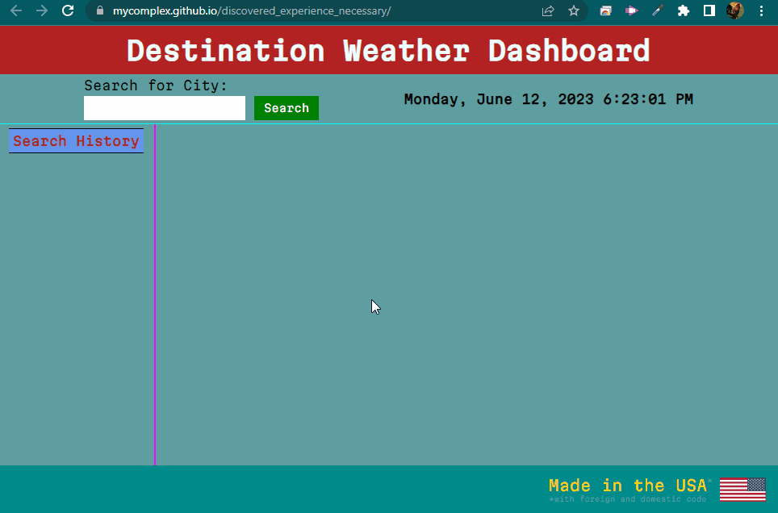

# 5-Day Weather Forecast Dashboard

## Table of Contents
- [Scope of Work](#scope-of-work)
- [Sample](#sample)
- [Live Website](#live-website)
- [Inspiration](#copyright)

## Scope of Work
Once upon a time, in a small town called Techville, there lived a mediocre old programmer named Pligeaux Findenmösle. Pligeaux had a deep passion for coding and longed to create innovative applications that could make people's lives easier. One day, as Pligeaux was sipping a cup of coffee at a local café, an idea struck their mind—a weather forecast dashboard app!

Excited about the prospect of building a useful tool, Pligeaux quickly grabbed a pen and a notebook and started brainstorming the features and functionalities they wanted to include in their app. After careful consideration, Pligeaux decided to make a 5-day weather forecast dashboard that would provide accurate and real-time weather information.

With a clear vision in mind, Pligeaux sat down at their computer and fired up their favorite code editor. They chose JavaScript as the programming language to bring their idea to life. Pligeaux began by setting up the project structure, creating the necessary HTML, CSS, and JavaScript files.

The first step was to integrate an API that would provide the weather data. Pligeaux researched various weather APIs and found a reliable one that offered comprehensive information for multiple days. They signed up for an API key and started working on the code to fetch the data.

Using JavaScript's fetch function, Pligeaux sent a request to the weather API, passing the necessary parameters such as the location and the number of forecasted days. The API responded with a JSON object containing all the required weather details. Pligeaux carefully parsed the JSON response, extracting the relevant information like temperature, humidity, wind speed, and weather conditions for each day.

With the weather data successfully retrieved, it was time to design the user interface. Pligeaux wanted the app to have an elegant and user-friendly layout. They created a clean and intuitive dashboard that displayed the current day's weather along with the forecast for the next four days.

Pligeaux leveraged CSS to style the dashboard, choosing soothing colors and eye-catching icons to represent different weather conditions. They also implemented responsive design principles, ensuring that the app would adapt seamlessly to various screen sizes, from desktops to mobile devices.

As the days flew by, Pligeaux meticulously fine-tuned the app, ensuring it was bug-free and provided accurate weather information. They added additional features like a search bar to allow users to input different locations, a refresh button to update the forecast, and a settings menu to customize the units of measurement.

Finally, after many sleepless nights and countless lines of code, Pligeaux's 5-day weather forecast dashboard app was ready. They shared it with their friends and family, who were impressed by its simplicity and usefulness. Word quickly spread about the incredible app developed by the mediocre programmer from Techville.

Soon, people from all over the town started using Pligeaux's weather app to plan their activities, from outdoor picnics to weekend hikes. The app became a go-to resource for weather forecasts, trusted for its accuracy and beautiful design.

Pligeaux's hard work and dedication paid off, and they were proud to have created a useful tool that made a positive impact on people's lives. They continued to improve and update the app, incorporating user feedback and adding new features like notifications and weather alerts.

As time went on, Pligeaux's weather forecast dashboard app gained popularity beyond Techville, reaching users from different cities and even countries. It became a shining example of what a passion for coding and a creative mind could accomplish.

And so, Pligeaux's journey as a programmer continued, filled with new ideas and exciting projects. Their weather app remained a testament to their skills and a reminder that a simple line of code could change the way people interacted with the world around them.

## Sample

## Live Website
Browse to https://mycomplex.github.io/discovered_experience_necessary/ to review.

## Inspiration
Inspiration provided by: various web examples; generative pre-trained transformer type AI; and of course the instructor lectures, support of the TAs, and patience of my tutor.
